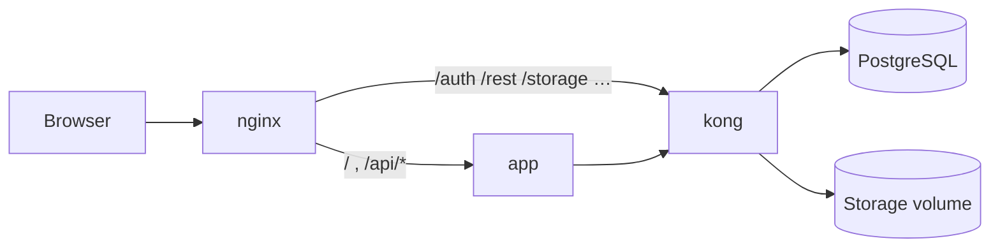
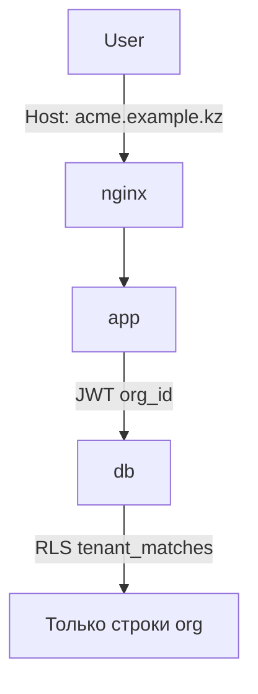
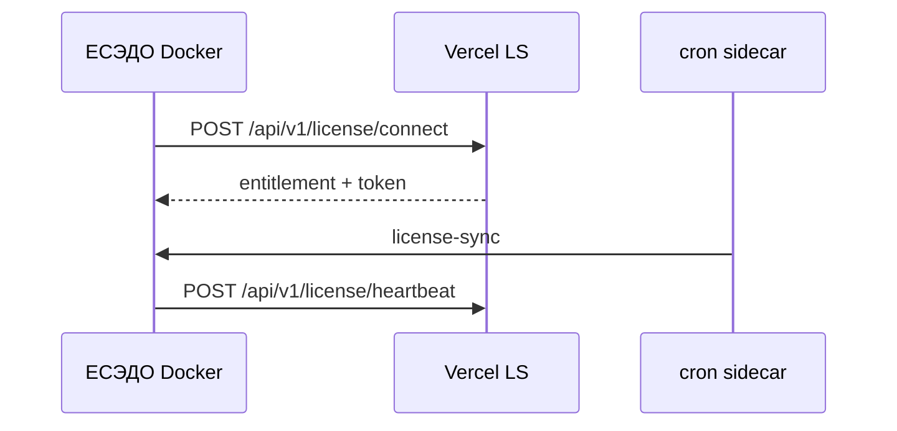
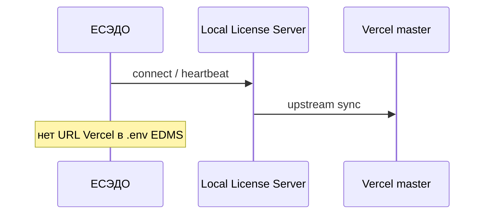

# Архитектура ЕСЭДО (Flowmaster Core)

Индекс документации: [README.md](./README.md).

Обзор компонентов, потоков запросов и схем лицензирования. Детали развёртывания — [DEPLOYMENT.md](./DEPLOYMENT.md).

## Монорепозиторий

```
flowmaster-core/
├── src/                         # ЕСЭДО (см. src/README.md, src/lib/api/README.md)
├── supabase/migrations/         # PostgreSQL (self-hosted Supabase)
├── docker/                      # Compose overlays, nginx, ONLYOFFICE (см. docker/README.md)
├── scripts/                     # env, orchestration, UAT, FM1 CLI (см. scripts/README.md)
├── apps/cloud-license-server/   # Vercel: license API + portal + Cloud Admin
├── docs/                        # Канонические runbook'и (см. docs/README.md)
├── wiki/                        # Краткие страницы для GitHub Wiki
└── e2e/                         # Playwright
```

Корневые `docker-compose*.yml` — **точки входа** Compose (стандарт Docker); overrides в `docker/compose/`.
Шаблоны env: `.env.docker.example`, `.env.example` (генерация через `npm run env:*`).

Отдельного `packages/` нет. Облачный LS вызывается через `npm run license:cloud:*` или `--prefix apps/cloud-license-server`.

## Runtime: ЕСЭДО (on-prem / SaaS)

### Стек

| Слой | Технология |
|------|------------|
| UI / SSR | React 19, TanStack Router/Query, Tailwind 4 |
| Server | Nitro + Server Functions (`src/routes/`, `src/server/`) |
| Auth | Custom JWT + `app_sessions`, Supabase Auth RPC, LDAP, ЭЦП, Telegram |
| БД | PostgreSQL 15+ (self-hosted Supabase в Docker) |
| Файлы | Supabase Storage |
| Proxy | nginx (единый origin для app и Supabase API) |

### Поток HTTP-запроса



| Путь (примеры) | Backend | Назначение |
|----------------|---------|------------|
| `/`, `/documents`, `/auth` (UI) | `app:3000` | SSR, Server Functions |
| `/api/v1/*`, `/api/public/hooks/*` | `app:3000` | REST API, cron hooks |
| `/auth/v1/*` | `kong:8000` | Supabase Auth |
| `/rest/v1/*` | `kong:8000` | PostgREST |
| `/storage/v1/*` | `kong:8000` | Файлы |
| `/onlyoffice/*` | `onlyoffice:80` | Document Server (profile `office`) |

**Важно:** в Docker контейнер `app` использует `SUPABASE_URL=http://kong:8000`; браузер — `VITE_SUPABASE_URL` через публичный nginx URL.

### Фоновые задачи

Cron sidecar (`profile cron`) или системный crontab вызывает internal hooks с `Authorization: Bearer $CRON_SECRET`:

- `email-dispatch`, `webhook-dispatch`, `sla-tick`, `retention-tick`
- `license-sync` — phone-home к license server (online)
- `telegram-poll` — опционально, одна реплика app

См. [DEPLOYMENT.md § Cron](./DEPLOYMENT.md#5-cron-jobs-обязательно).

### Multi-tenant (опционально)

Одна инсталляция — несколько `organization` в одной БД. Изоляция: `organization_id` + RLS `tenant_matches`, JWT `org_id`, резолв slug из `Host`.



Подробнее: [MULTI-TENANT.md](./MULTI-TENANT.md).

## Лицензирование: четыре режима

| Режим | `LICENSE_MODE` | License server | Типичный сценарий |
|-------|----------------|----------------|-------------------|
| Offline FM1 | `offline` | — | Изолированный контур, ключ в UI |
| Online облако | `online` | Vercel | On-prem EDMS + `apps/cloud-license-server` |
| Online vendor | `online` | Docker `compose:license-server` | Self-hosted LS у поставщика |
| Hybrid | `hybrid` | любой online | Online + fallback на локальный FM1 |
| Replica | `online` на EDMS | Local LS → Vercel upstream | Закрытый контур (КИИ) |

### Фаза 1: EDMS → Vercel (облако)



Env на EDMS: `LICENSE_SERVER_URL`, `INSTALLATION_ID`, `LICENSE_MODE=online`. **Без** `LICENSE_SERVER_ENABLED=true`.

Подробнее: [LICENSE-SERVER.md § EDMS + Vercel](./LICENSE-SERVER.md#edms-vercel-cloud).

### Фаза 2: Replica (закрытый контур)



Подробнее: [LICENSE-SERVER.md § Replica](./LICENSE-SERVER.md#replica-phase-2).

### Облачный license server (Vercel)

Отдельный Supabase-проект, отдельные миграции `apps/cloud-license-server/supabase/migrations/001…005`.

| UI | URL | Аудитория |
|----|-----|-----------|
| Landing / pricing | `/` | Публичный |
| Кабинет клиента | `/cabinet` | Клиенты (Supabase Auth) |
| Cloud Admin | `/admin` → `/admin/app` | Вендор (`vendor_staff` + Telegram) |
| Machine API | `/api/v1/license/*` | EDMS, CI (Bearer) |

Подробнее: [apps/cloud-license-server/README.md](../apps/cloud-license-server/README.md).

<a id="db-migrations"></a>

## Миграции БД (ключевые)

### ЕСЭДО — tenant

| Файл | Содержание |
|------|------------|
| `20260612030000_tenant_foundation.sql` | slug, tenant_mode |
| `20260612040000_tenant_isolation.sql` | organization_id, RLS sweep |
| `20260614000000_phase3_tenant_rls_complete.sql` | Полный tenant RLS |

### ЕСЭДО — лицензии

| Файл | Содержание |
|------|------------|
| `20260611120000_installation_license.sql` | Локальная лицензия, FM1 |
| `20260611280000_license_server_online.sql` | Online / heartbeat |
| `20260615200000_license_cloud_connect.sql` | Connect по `installation_id` |
| `20260616100000_license_server_upstream_replica.sql` | Local LS replica |
| `20260617100000_license_server_usage_telemetry.sql` | Телеметрия heartbeat |

### Cloud LS (отдельный Supabase)

`001_license_server_schema.sql` … `005_vendor_staff.sql` — см. [cloud README](../apps/cloud-license-server/README.md#база-данных).

## Compose-стеки

| Compose file | Project | Назначение |
|--------------|---------|------------|
| `docker-compose.yml` | `flowmaster` | HTTP local / on-prem |
| `docker-compose.tls.yml` | `flowmaster` | HTTPS production |
| `docker-compose.staging.yml` | `flowmaster-staging` | UAT :8080 |
| `docker-compose.license-server.yml` | `flowmaster-license-server` | Vendor LS |
| `docker-compose.dev.yml` | `flowmaster-dev` | Supabase only (host dev) |

См. [docker/README.md](../docker/README.md).

## Безопасность (кратко)

- RLS на tenant-таблицах, RBAC через `user_has_permission()`
- API keys `fm_*`, webhooks HMAC, cron `CRON_SECRET`
- Секреты только в `.env` на сервере

Полный чеклист: [SECURITY.md](./SECURITY.md).

## Связанные документы

| Документ | Тема |
|----------|------|
| [DEPLOYMENT.md](./DEPLOYMENT.md) | TLS, backup, deploy |
| [ENV.md](./ENV.md) | Переменные окружения |
| [CI.md](./CI.md) | GitHub Actions, smoke |
| [LICENSE-SERVER.md](./LICENSE-SERVER.md) | License flows, API |
| [INTEGRATIONS.md](./INTEGRATIONS.md) | REST v1, ONLYOFFICE, LDAP |
| [GLOSSARY.md](./GLOSSARY.md) | Термины |
| [RUNBOOK.md](./RUNBOOK.md) | Эксплуатация, backup |
| [TROUBLESHOOTING.md](./TROUBLESHOOTING.md) | Быстрые фиксы |
| [CONTRIBUTING.md](./CONTRIBUTING.md) | Разработка |
