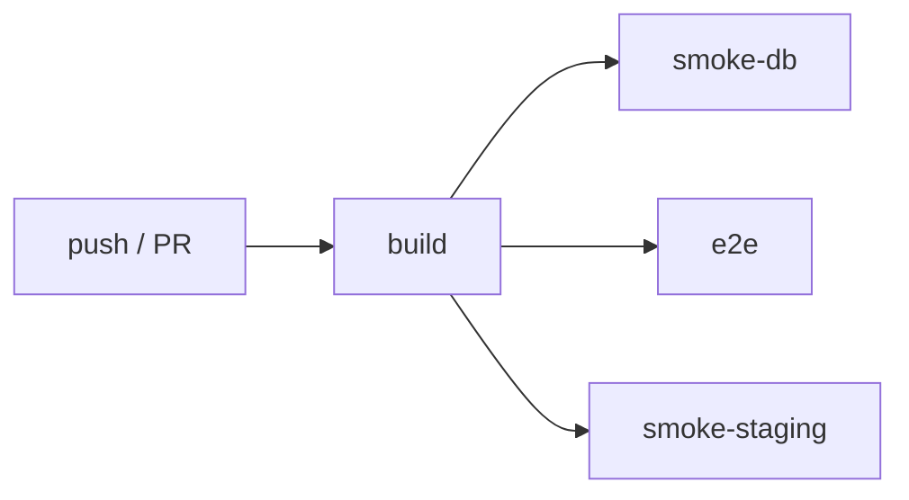

# CI/CD

Индекс документации: [README.md](./README.md).

GitHub Actions: [.github/workflows/ci.yml](../.github/workflows/ci.yml).

## Pipeline overview



| Job | Условие | Что проверяет |
|-----|---------|---------------|
| **build** | всегда | `lint`, `typecheck`, `test`, `build` |
| **smoke-db** | secrets Supabase | `uat:smoke:db` — миграции, RPC, RLS |
| **e2e** | secrets E2E + Supabase | Playwright `test:e2e` (поднимает preview) |
| **smoke-staging** | secrets staging + E2E | `uat:smoke:full` против живого staging |

Node.js **22** во всех job. `build` использует `npm ci`; E2E/staging — `npm ci --legacy-peer-deps`.

## Job: build

Всегда выполняется на `main` / `master` и PR.

```yaml
npm run lint
npm run typecheck
npm run test
npm run build
```

Build env — placeholder Supabase (только для сборки Vite):

| Variable | Значение в CI |
|----------|---------------|
| `VITE_SUPABASE_URL` | `https://placeholder.supabase.co` |
| `VITE_SUPABASE_PUBLISHABLE_KEY` | `placeholder-anon-key` |
| `SUPABASE_URL` | то же |
| `SUPABASE_PUBLISHABLE_KEY` | то же |
| `SUPABASE_SERVICE_ROLE_KEY` | `placeholder-service-role` |
| `SUPABASE_JWT_SECRET` | `placeholder-jwt-secret-for-ci-build-only` |

Локально: `npm ci --legacy-peer-deps` — см. [CONTRIBUTING.md](./CONTRIBUTING.md) (peer-deps TanStack/shadcn).

Облачный **z-license** собирается и деплоится из отдельного репозитория; CI этого репозитория проверяет только ЕСЭДО.

## GitHub Secrets

Настройка: **Repository → Settings → Secrets and variables → Actions**.

### smoke-db

| Secret | Назначение |
|--------|------------|
| `E2E_SUPABASE_URL` | Supabase API URL (staging DB или dedicated CI project) |
| `E2E_SUPABASE_SERVICE_ROLE_KEY` | Service role для RPC smoke |

Job запускается только если **оба** secret заданы.

### e2e

| Secret | Назначение |
|--------|------------|
| `E2E_EMAIL` | Тестовый пользователь (create_documents + approve) |
| `E2E_PASSWORD` | Пароль |
| `E2E_SUPABASE_URL` | Supabase URL |
| `E2E_SUPABASE_PUBLISHABLE_KEY` | Anon key |
| `E2E_SUPABASE_SERVICE_ROLE_KEY` | Service role |
| `E2E_SUPABASE_JWT_SECRET` | JWT secret |

При падении загружается artifact `playwright-report` (7 дней).

### smoke-staging

| Secret | Назначение |
|--------|------------|
| `STAGING_APP_URL` | Напр. `http://host:8080` или `https://staging.example.kz` |
| `CRON_SECRET` | Production/staging cron secret |
| `E2E_SUPABASE_URL` | Supabase staging |
| `E2E_SUPABASE_SERVICE_ROLE_KEY` | Service role |
| `E2E_EMAIL` / `E2E_PASSWORD` | E2E user |

Эквивалент локально:

```bash
APP_URL=https://staging.example.kz \
CRON_SECRET=... \
SUPABASE_URL=... \
SUPABASE_SERVICE_ROLE_KEY=... \
E2E_EMAIL=... E2E_PASSWORD=... \
E2E_SKIP_SERVER=1 \
npm run uat:smoke:full
```

## Локальные smoke-команды

| Команда | Scope |
|---------|-------|
| `npm run uat:preflight` | bash: health + cron hooks |
| `npm run uat:smoke` | health, cron, migrations, DB |
| `npm run uat:smoke:db` | только DB/RPC (как CI smoke-db) |
| `npm run uat:smoke:full` | smoke + Playwright |
| `npm run test:e2e:security` | health + security routes |

Переменные: [ENV.md § UAT/E2E](./ENV.md#uat-e2e-ci).

## Production deploy

### Рекомендуемый flow (Docker on-prem)

На сервере (env **не** в git):

```bash
git pull
npm run env:production -- --domain=esedo.example.kz --email=admin@example.kz --install
npm run docker:migrate -- --tls
npm run compose:tls:cron
npm run uat:smoke    # APP_URL=https://esedo.example.kz ...
```

### Shell-скрипт

`npm run deploy:production` → `scripts/deploy-production.sh`

Переопределение через env перед запуском:

```bash
DOMAIN=esedo.example.kz \
EMAIL=admin@example.kz \
LICENSE_URL=https://your-project.vercel.app \
INSTALLATION_ID=<uuid> \
./scripts/deploy-production.sh
```

Флаги скрипта: `SKIP_PULL=1`, `SKIP_ENV=1`, `SKIP_MIGRATE=1`.

### Облачный license server (z-license)

Сборка и CI **z-license** — в отдельном репозитории. Production deploy — Vercel auto-deploy; env — Vercel Dashboard проекта z-license.

## Чеклист перед релизом

- [ ] `npm run lint && npm run typecheck && npm run test`
- [ ] `npm run docker:migrate` на target stack
- [ ] `npm run uat:smoke` (или `uat:smoke:full` на staging)
- [ ] `/api/health` → `database: ok`
- [ ] Cron: `license-sync` (если online license)
- [ ] Backup БД (см. [RUNBOOK.md § Backup](./RUNBOOK.md#backup))

## Связанные документы

| Документ | Тема |
|----------|------|
| [DEPLOYMENT.md](./DEPLOYMENT.md) | TLS, cron, обновление версии |
| [STAGING.md](./STAGING.md) | UAT stack |
| [ENV.md](./ENV.md) | Переменные окружения |
| [RUNBOOK.md](./RUNBOOK.md) | Backup, инциденты, откат |
| [TROUBLESHOOTING.md](./TROUBLESHOOTING.md) | Сбои CI / Docker |
