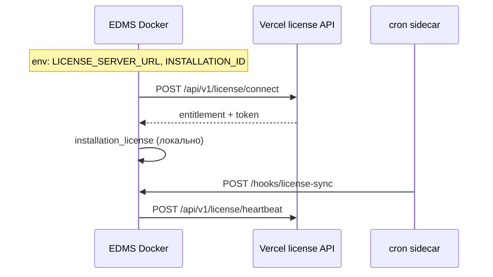

# Сервер лицензирования (vendor)

Отдельный деплой license server. Клиентские инсталляции обращаются к нему по `LICENSE_SERVER_URL`.

**Варианты деплоя:**

| Вариант | Когда использовать |
|---------|-------------------|
| **[Vercel — `apps/cloud-license-server`](../apps/cloud-license-server/README.md)** | Облако без своего Docker, serverless |
| **Docker — `compose:license-server`** | Self-hosted на своём VPS |

**Админка vendor не входит в EDMS**. Для Docker: локально через support code и SSH tunnel. Для **Vercel**: `/admin` на том же домене (support code + httpOnly cookie). Bearer API — для автomation.

## Связка EDMS (on-prem) + Vercel (облако)

Типовая схема: **EDMS в Docker** на `edms.satory.kz`, **license server на Vercel** (`https://z-edms.vercel.app`).



| Где | Что |
|-----|-----|
| **Vercel** | `apps/cloud-license-server` — API, кабинет, регистрация trial, `installation_id` |
| **EDMS `.env`** | `LICENSE_SERVER_URL`, `INSTALLATION_ID`, `LICENSE_MODE=online` |
| **EDMS app** | При старте: `connect` по `installation_id` (без FM1-ключа) |
| **cron** | `--cron` → heartbeat каждые ~6 ч |

**Важно:** для облака **не** нужны `npm run compose:license-server` и **не** нужен `LICENSE_SERVER_ENABLED=true` на EDMS. Отдельный Docker license server — только для self-hosted vendor.

### Генерация `.env` (облачная связка)

```bash
npm run env:production -- \
  --domain=edms.satory.kz \
  --email=support@satory.kz \
  --with-license-server \
  --license-server-url=https://z-edms.vercel.app \
  --installation-id=da23803d-1048-4526-b5d8-09c9e95c2999 \
  --force \
  --install
```

Флаги `--with-license-server` + `--license-server-url` вместе означают: **online-клиент к облаку** (не встроенный vendor API на том же домене).

### Деплой EDMS

```bash
npm run docker:up -- --tls
npm run docker:up -- --tls --cron

curl https://edms.satory.kz/api/health
curl https://z-edms.vercel.app/api/v1/license/health
```

Проверка в UI: **Администрирование → Настройки → Лицензия → «Синхронизировать»**.

---

## Быстрый старт (Vercel)

Публикуется как **единый проект**: landing + кабинет клиента + license API.

```bash
# 1. Supabase: миграции 001 + 002, Auth Email включён
# 2. Vercel Root Directory = apps/cloud-license-server
# 3. Env: SUPABASE_*, LICENSE_SERVER_ADMIN_SECRET, VITE_SUPABASE_*, VITE_LICENSE_SERVER_URL
# 4. Deploy → LICENSE_SERVER_URL=https://xxx.vercel.app на клиентах
```

- `/` — landing с тарифами  
- `/register`, `/cabinet` — личный кабинет (пробная лицензия + installation_id)  
- `/api/v1/license/*` — API для EDMS  

Подробнее: [apps/cloud-license-server/README.md](../apps/cloud-license-server/README.md)

## Быстрый старт (Docker / self-hosted)

```bash
# 1. Сгенерировать .env (секреты LICENSE_SIGNING_SECRET + LICENSE_SERVER_ADMIN_SECRET)
npm run env:license-server -- --domain=license.satory.kz --email=admin@satory.kz --install

# 2. Запустить стек (migrate + wait включены)
npm run compose:license-server

# 3. Проверить
curl -k https://license.satory.kz/api/v1/license/health
```

## Локальная админка (support code + SSH)

На **хосте license server** (по SSH), в каталоге с `.env`:

```bash
# Терминал 1 — UI только на 127.0.0.1:3847
npm run license:admin

# Терминал 2 — одноразовый код (15 мин)
npm run license:support-code
# → 12345678
```

С **ноутбука**:

```bash
ssh -L 3847:127.0.0.1:3847 user@license-server
```

Браузер: `http://127.0.0.1:3847/vendor/license` → ввести support code.

Переменные (только при `npm run license:admin`, **не** в docker compose):

| Переменная | Описание |
|------------|----------|
| `LICENSE_SERVER_LOCAL_ADMIN=true` | Включает `/vendor/license/*` |
| `LICENSE_SERVER_ENABLED=true` | Доступ к таблицам license server |
| `LICENSE_SERVER_ADMIN_SECRET` | Подпись support code и сессии |

На публичном деплое (`compose:license-server`) `LICENSE_SERVER_LOCAL_ADMIN` **не задаётся** — маршруты `/vendor/*` отдают 404.

## Роли

| Роль | Где | Переменные | Связь |
|------|-----|------------|-------|
| **License server (Vercel)** | `apps/cloud-license-server` | Supabase, `LICENSE_SERVER_ADMIN_SECRET` | Принимает `connect` / `heartbeat` |
| **Клиент EDMS (облако)** | Docker on-prem | `LICENSE_SERVER_URL`, `INSTALLATION_ID`, `LICENSE_MODE=online` | → Vercel API |
| **License server (Docker vendor)** | `compose:license-server` | `LICENSE_SERVER_ENABLED=true` | Self-hosted, FM1/CLI |
| **Клиент (legacy offline)** | on-prem | `LICENSE_MODE=offline`, FM1-ключ | Без облака |

На клиентских EDMS маршруты `/api/v1/license/*` **отключены** (`LICENSE_SERVER_ENABLED=false` или не задан).

## Выдача ключей

```bash
# FM1-ключ (на машине vendor)
npm run license:generate -- --plan professional --customer "Организация"

# CLI register/revoke (Bearer LICENSE_SERVER_ADMIN_SECRET)
npm run license:server -- register --key "FM1...."
npm run license:server -- revoke --installation-id <uuid>
```

Или через локальную админку после входа по support code.

## Подключение клиента (облачная схема)

См. раздел **[Связка EDMS + Vercel](#связка-edms-on-prem--vercel-облако)** выше.

Кратко: клиент **не вводит FM1-ключ**. EDMS при старте вызывает `POST {LICENSE_SERVER_URL}/api/v1/license/connect` с `installation_id` из кабинета Vercel.

```bash
npm run env:production -- \
  --domain=edms.satory.kz \
  --with-license-server \
  --license-server-url=https://z-edms.vercel.app \
  --installation-id=da23803d-1048-4526-b5d8-09c9e95c2999 \
  --install
```

`installation_id` должен быть **зарегистрирован** на Vercel (регистрация в кабинете или admin console).

Статус на клиенте: **Администрирование → Настройки → Лицензия** (просмотр и «Синхронизировать»).

При потере связи с облаком EDMS переходит в **offline mode** — лицензия остаётся активной по последней синхронизации (кроме явного отзыва или истечения срока).

## API

| Метод | Путь | Auth | Описание |
|-------|------|------|----------|
| GET | `/api/v1/license/health` | — | Health license server |
| POST | `/api/v1/license/connect` | — | Автоподключение по `installation_id` (без FM1) |
| POST | `/api/v1/license/activate` | — | Активация по FM1-ключу (legacy) |
| POST | `/api/v1/license/heartbeat` | Token | Phone-home |
| POST | `/api/v1/license/provision` | Bearer admin | Регистрация installation_id (cloud) |
| POST | `/api/v1/license/generate-key` | Bearer admin | FM1 + provision (legacy) |
| POST | `/api/v1/license/register-key` | Bearer admin | Pre-register FM1 |
| POST | `/api/v1/license/revoke` | Bearer admin | Отзыв |

## npm-команды

| Команда | Описание |
|---------|----------|
| `npm run env:license-server` | Генерация `.env.license-server` |
| `npm run compose:license-server` | Docker TLS stack (без web admin) |
| `npm run license:generate` | Создать FM1-ключ |
| `npm run license:server` | Admin CLI (register/revoke) |
| `npm run license:support-code` | Support code для локальной админки |
| `npm run license:admin` | Локальный UI на 127.0.0.1 |

См. также: [DEPLOYMENT.md](./DEPLOYMENT.md), [SECURITY.md](./SECURITY.md).
