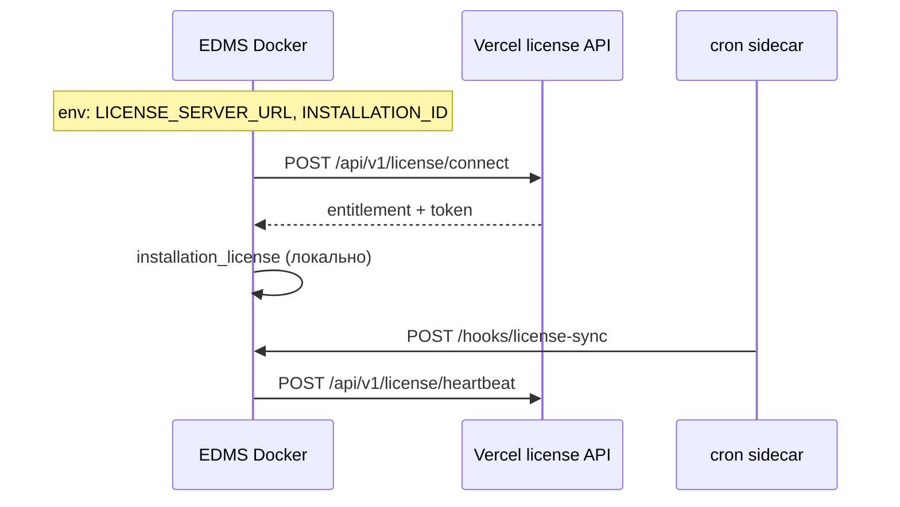
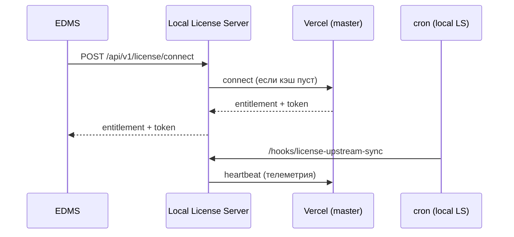

# Сервер лицензирования (vendor)

Отдельный деплой license server. Клиентские инсталляции обращаются к нему по `LICENSE_SERVER_URL`.

**Варианты деплоя:**

| Вариант | Когда использовать |
|---------|-------------------|
| **[Vercel — `apps/cloud-license-server`](../apps/cloud-license-server/README.md)** | Облако без своего Docker, serverless |
| **Docker — `compose:license-server`** | Self-hosted на своём VPS |

**Интерфейсы вендора не для клиентов** (клиенты — `/cabinet` на Vercel). Разные UI и **разные типы входа**:

| Интерфейс | Деплой | URL | Вход |
|-----------|--------|-----|------|
| **Console** | Локальный license server (Docker self-hosted) | `/vendor/license` на `127.0.0.1:3847` | **Support code** (8 цифр, 15 мин) + SSH tunnel |
| **Admin** | Облачный license server (Vercel) | `/admin` → `/admin/verify` → `/admin/app` | **Email + пароль** (таблица `vendor_staff`) + **Telegram** или **webhook** |
| **Кабинет** | Vercel | `/cabinet` | Email + пароль клиента (Supabase Auth) |

Bearer API (`LICENSE_SERVER_ADMIN_SECRET`) — для automation, не для браузерного входа.

**Telegram для Cloud Admin** — **отдельный бот вендора** (`VENDOR_TELEGRAM_*` на Vercel), не бот EDMS у клиента (`TELEGRAM_BOT_TOKEN` в Docker EDMS).

| | Бот вендора | Бот EDMS (клиент) |
|---|-------------|-------------------|
| Назначение | Подтверждение `/admin` | Уведомления, вход в EDMS |
| Env | `VENDOR_TELEGRAM_BOT_TOKEN` | `TELEGRAM_BOT_TOKEN` |
| Webhook | `{license-server}/api/v1/hooks/telegram` | `{edms}/api/public/hooks/telegram-webhook` |

## Связка EDMS (on-prem) + Vercel (облако)

Типовая схема: **EDMS в Docker** на `edms.satory.kz`, **license server на Vercel** (`https://z-edms.vercel.app`).



| Где | Что |
|-----|-----|
| **Vercel** | `apps/cloud-license-server` — API, кабинет, регистрация trial, `installation_id` |
| **EDMS `.env`** | `LICENSE_SERVER_URL`, `INSTALLATION_ID`, `LICENSE_MODE=online` |
| **EDMS app** | При старте: `connect` по `installation_id` (без FM1-ключа) |
| **cron** | `--cron` → heartbeat каждые ~6 ч |

**Важно:** для облака **не** нужны `npm run compose:license-server` и **не** нужен `LICENSE_SERVER_ENABLED=true` на EDMS. Отдельный Docker license server — только для self-hosted vendor.

### Генерация `.env` (облачная связка)

```bash
npm run env:production -- \
  --domain=edms.satory.kz \
  --email=support@satory.kz \
  --with-license-server \
  --license-server-url=https://z-edms.vercel.app \
  --installation-id=da23803d-1048-4526-b5d8-09c9e95c2999 \
  --force \
  --install
```

Флаги `--with-license-server` + `--license-server-url` вместе означают: **online-клиент к облаку** (не встроенный vendor API на том же домене).

### Деплой EDMS

```bash
npm run docker:up -- --tls
npm run docker:up -- --tls --cron

curl https://edms.satory.kz/api/health
curl https://z-edms.vercel.app/api/v1/license/health
```

Проверка в UI: **Администрирование → Настройки → Лицензия → «Синхронизировать»**.

---

## Фаза 2: Local License Server (replica) + Cloud master

Для Enterprise / КИИ / закрытых контуров: **EDMS не ходит в интернет напрямую**, только в локальный License Server; тот синхронизируется с облаком vendor.



| Компонент | Переменные |
|-----------|------------|
| **Cloud (master)** | Vercel, кабинет, `installation_id` |
| **Local LS (replica)** | `LICENSE_SERVER_ENABLED=true`, `LICENSE_UPSTREAM_URL`, `INSTALLATION_ID` |
| **EDMS** | `LICENSE_SERVER_URL=https://license.client.kz`, `LICENSE_SERVER_ENABLED=false` |

### Генерация env (оба стека)

```bash
npm run env:production -- \
  --domain=edms.client.kz \
  --email=admin@client.kz \
  --license-domain=license.client.kz \
  --license-replica \
  --license-server-url=https://z-edms.vercel.app \
  --installation-id=da23803d-1048-4526-b5d8-09c9e95c2999 \
  --with-license-server \
  --force \
  --install
```

Создаёт:
- `.env` — EDMS → `https://license.client.kz`
- `.env.license-server` — replica с `LICENSE_UPSTREAM_URL=https://z-edms.vercel.app`

### Деплой

```bash
# 1. Local License Server (в контуре клиента)
cp .env.license-server .env
npm run compose:license-server
curl https://license.client.kz/api/v1/license/health

# 2. EDMS (тот же или другой хост)
cp .env.production .env   # если не --install
npm run docker:up -- --tls --cron
```

Local LS при первом `connect` от EDMS подтягивает entitlement с облака. Cron на replica: `POST /api/public/hooks/license-upstream-sync` → heartbeat в Vercel.

### Закрытый контур (EDMS без выхода в интернет)

**Когда применять:** заказчик запрещает прямой HTTPS из EDMS наружу (КИИ, госсектор, промышленная сеть). EDMS видит только внутренний DNS; в `.env` **нет** URL Vercel.

```text
                    Интернет / DMZ
                           │
              исходящий HTTPS (443) — только с хоста Local LS
                           │
    ┌──────────────────────┼──────────────────────┐
    │   Контур заказчика   │                      │
    │                      ▼                      │
    │         Local License Server                │
    │         license.internal (443)              │
    │                      │                      │
    │         ┌────────────┴────────────┐         │
    │         ▼                         ▼         │
    │      EDMS app              cron (local LS)  │
    │   edms.internal          upstream-sync     │
    │   LICENSE_SERVER_URL=      LICENSE_UPSTREAM │
    │   https://license...       _URL → Vercel    │
    │   ❌ нет Vercel URL        ✅ один шлюз     │
    └─────────────────────────────────────────────┘
```

| Правило | EDMS | Local LS |
|---------|------|----------|
| Исходящий интернет | **Запрещён** | Разрешён (443 → Vercel) или через корп. proxy |
| Входящий из интернета | Не нужен | Не нужен |
| Маршрут лицензии | → `LICENSE_SERVER_URL` (внутренний) | → `LICENSE_UPSTREAM_URL` (облако) |
| Данные документов наружу | Нет | Нет — только агрегированная телеметрия (см. ниже) |

**`.env` EDMS (важно):**

```env
LICENSE_SERVER_URL=https://license.internal.client.kz
LICENSE_MODE=online
LICENSE_SERVER_ENABLED=false
# LICENSE_UPSTREAM_URL — не задавать на EDMS
# URL Vercel — только в .env.license-server
```

**`.env` Local LS:**

```env
LICENSE_SERVER_ENABLED=true
LICENSE_UPSTREAM_URL=https://z-edms.vercel.app
INSTALLATION_ID=da23803d-1048-4526-b5d8-09c9e95c2999
```

**Поведение при обрыве связи Local LS ↔ облако:**

- EDMS продолжает ходить только во **внутренний** LS;
- Local LS отдаёт **закэшированную** entitlement (таблицы `license_server_provisions`, `license_server_upstream_cache`);
- бизнес EDMS не останавливается, пока не истечёт срок лицензии или не придёт отзыв при следующем успешном sync.

**Полностью изолированная сеть** (Local LS тоже без интернета, даже через DMZ) — в roadmap: offline activation (request/license file). До этого нужен хотя бы периодический исходящий канал с **одного** хоста Local LS.

**Фаза 1 vs Фаза 2:**

| | Фаза 1 | Фаза 2 |
|---|--------|--------|
| EDMS → интернет | Да (`LICENSE_SERVER_URL` = Vercel) | **Нет** |
| Подходит для | Обычный on-prem с исходящим HTTPS | КИИ / закрытый контур |
| Сложность | Минимальная | +1 Docker-стек (Local LS) |

### Roadmap (после MVP replica)

| Функция | Статус |
|---------|--------|
| Replica sync (connect + upstream heartbeat) | ✅ MVP |
| Floating licenses | 🔜 |
| Offline activation (request/license file) | 🔜 |
| JWT license tokens для desktop/API nodes | 🔜 |
| Grace 30–90 дней (настраиваемый) | 🔜 |

---

## Быстрый старт (Vercel)

Публикуется как **единый проект**: landing + кабинет клиента + license API.

```bash
# 1. Supabase: миграции 001 + 002, Auth Email включён
# 2. Vercel Root Directory = apps/cloud-license-server
# 3. Env: SUPABASE_*, LICENSE_SERVER_ADMIN_SECRET, VITE_SUPABASE_*, VITE_LICENSE_SERVER_URL
# 4. Deploy → LICENSE_SERVER_URL=https://xxx.vercel.app на клиентах
```

- `/` — landing с тарифами  
- `/register`, `/cabinet` — личный кабинет (пробная лицензия + installation_id)  
- `/api/v1/license/*` — API для EDMS  

Подробнее: [apps/cloud-license-server/README.md](../apps/cloud-license-server/README.md)

## Быстрый старт (Docker / self-hosted)

```bash
# 1. Сгенерировать .env (секреты LICENSE_SIGNING_SECRET + LICENSE_SERVER_ADMIN_SECRET)
npm run env:license-server -- --domain=license.satory.kz --email=admin@satory.kz --install

# 2. Запустить стек (migrate + wait включены)
npm run compose:license-server

# 3. Проверить
curl -k https://license.satory.kz/api/v1/license/health
```

## Console — локальный сервер (support code + SSH)

На **хосте license server** (по SSH), в каталоге с `.env`:

```bash
# Терминал 1 — UI только на 127.0.0.1:3847
npm run license:admin

# Терминал 2 — одноразовый код (15 мин)
npm run license:support-code
# → 12345678
```

С **ноутбука**:

```bash
ssh -L 3847:127.0.0.1:3847 user@license-server
```

Браузер: `http://127.0.0.1:3847/vendor/license` → **Console** → ввести support code.

Для **облачного** сервера на Vercel используйте **Admin**: `https://<project>.vercel.app/admin` (email + пароль сотрудника вендора из `LICENSE_SERVER_VENDOR_ADMIN_EMAILS`). См. [apps/cloud-license-server/README.md](../apps/cloud-license-server/README.md).

Переменные (только при `npm run license:admin`, **не** в docker compose):

| Переменная | Описание |
|------------|----------|
| `LICENSE_SERVER_LOCAL_ADMIN=true` | Включает `/vendor/license/*` |
| `LICENSE_SERVER_ENABLED=true` | Доступ к таблицам license server |
| `LICENSE_SERVER_ADMIN_SECRET` | Подпись support code и сессии |

На публичном деплое (`compose:license-server`) `LICENSE_SERVER_LOCAL_ADMIN` **не задаётся** — маршруты `/vendor/*` отдают 404.

## Роли

| Роль | Где | Переменные | Связь |
|------|-----|------------|-------|
| **License server (Vercel)** | `apps/cloud-license-server` | Supabase, `LICENSE_SERVER_ADMIN_SECRET` | Принимает `connect` / `heartbeat` |
| **Клиент EDMS (облако)** | Docker on-prem | `LICENSE_SERVER_URL`, `INSTALLATION_ID`, `LICENSE_MODE=online` | → Vercel API |
| **Клиент EDMS (replica)** | Docker on-prem | `LICENSE_SERVER_URL` → local LS | → Local LS → Cloud |
| **Local LS (replica)** | Docker у клиента | `LICENSE_UPSTREAM_URL`, `INSTALLATION_ID` | → Vercel (sync) |
| **License server (Docker vendor)** | `compose:license-server` | `LICENSE_SERVER_ENABLED=true` | Self-hosted, FM1/CLI |
| **Клиент (legacy offline)** | on-prem | `LICENSE_MODE=offline`, FM1-ключ | Без облака |

На клиентских EDMS маршруты `/api/v1/license/*` **отключены** (`LICENSE_SERVER_ENABLED=false` или не задан).

## Выдача ключей

```bash
# FM1-ключ (на машине vendor)
npm run license:generate -- --plan professional --customer "Организация"

# CLI register/revoke (Bearer LICENSE_SERVER_ADMIN_SECRET)
npm run license:server -- register --key "FM1...."
npm run license:server -- revoke --installation-id <uuid>
```

Или через **Console** (локальный сервер, support code) или **Admin** (Vercel, email + пароль).

## Подключение клиента (облачная схема)

См. раздел **[Связка EDMS + Vercel](#связка-edms-on-prem--vercel-облако)** выше.

Кратко: клиент **не вводит FM1-ключ**. EDMS при старте вызывает `POST {LICENSE_SERVER_URL}/api/v1/license/connect` с `installation_id` из кабинета Vercel.

```bash
npm run env:production -- \
  --domain=edms.satory.kz \
  --with-license-server \
  --license-server-url=https://z-edms.vercel.app \
  --installation-id=da23803d-1048-4526-b5d8-09c9e95c2999 \
  --install
```

`installation_id` должен быть **зарегистрирован** на Vercel (регистрация в кабинете или admin console).

Статус на клиенте: **Администрирование → Настройки → Лицензия** (просмотр и «Синхронизировать»).

При потере связи с облаком EDMS переходит в **offline mode** — лицензия остаётся активной по последней синхронизации (кроме явного отзыва или истечения срока).

## Телеметрия использования

При синхронизации (`POST /api/v1/license/heartbeat`, cron `license-sync`) локальный EDMS отправляет **только агрегированные** показатели в поле `telemetry`. Конфиденциальные данные (содержимое документов, ФИО, email, номера, тексты) **не передаются**.

| Поле | Описание |
|------|----------|
| `total_users` | Число учётных записей (`profiles`) |
| `active_users` | Пользователей по лимиту лицензии (`license_active_user_count`) |
| `max_users_allowed` | Лимит из локальной лицензии |
| `documents_total` | Всего документов (count) |
| `documents_30d` | Новых документов за 30 дней |
| `workflows_published` | Опубликованных маршрутов |
| `app_version` | Версия ЕСЭДО |
| `environment` | `production` / `development` / … |
| `platform` | Версия Node.js |

Дополнительно в heartbeat: `installation_id`, `hostname`, `app_version`, `active_users` (legacy-поле).

На license server данные сохраняются в `license_server_activations.telemetry` (последний снимок) и `license_server_telemetry_snapshots` (история). Отображение:

- **Кабинет клиента** (`/cabinet`) — блок «Телеметрия использования»
- **Cloud Admin** (`/admin/app` → Активации) — пользователи, документы, версия
- **Console** (локальный LS) — те же данные в разделе активаций

Миграции: `apps/cloud-license-server/supabase/migrations/003_usage_telemetry.sql` (облако), `supabase/migrations/20260617100000_license_server_usage_telemetry.sql` (self-hosted LS / replica).

## API

| Метод | Путь | Auth | Описание |
|-------|------|------|----------|
| GET | `/api/v1/license/health` | — | Health license server |
| POST | `/api/v1/license/connect` | — | Автоподключение по `installation_id` (без FM1) |
| POST | `/api/v1/license/activate` | — | Активация по FM1-ключу (legacy) |
| POST | `/api/v1/license/heartbeat` | Token | Phone-home |
| POST | `/api/v1/license/provision` | Bearer admin | Регистрация installation_id (cloud) |
| POST | `/api/v1/license/generate-key` | Bearer admin | FM1 + provision (legacy) |
| POST | `/api/v1/license/register-key` | Bearer admin | Pre-register FM1 |
| POST | `/api/v1/license/revoke` | Bearer admin | Отзыв |

## npm-команды

| Команда | Описание |
|---------|----------|
| `npm run env:license-server` | Генерация `.env.license-server` |
| `npm run compose:license-server` | Docker TLS stack (без web admin) |
| `npm run license:generate` | Создать FM1-ключ |
| `npm run license:server` | Admin CLI (register/revoke) |
| `npm run license:support-code` | Support code для локальной админки |
| `npm run license:admin` | Локальный UI на 127.0.0.1 |

См. также: [DEPLOYMENT.md](./DEPLOYMENT.md), [SECURITY.md](./SECURITY.md).
